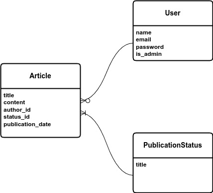

# Blog Application

This is a full-stack application that brings you the
ability to have a blog.

## Index

* [Requirements](#requirements)
  * [List](#requirement-list)
* [Structure](#structure)
* [Usage](#usage)
  * [Run the application](#run-application)
  * [See containers status](#status)
  * [Stop the application](#down)
  * [Destroy made containers](#destroy)
  * [Log into the container](#shell)
  * [View log of containers](#view-logs)
* [Tests](#tests)
  * [Check Coverage](#coverage-report)
* [Telescope](#telescope)
* [Background Jobs](#background-jobs)
* [Postman](#postman)

## Structure

The project structure is as bellow

- .assets `The assets of the readme file are placed here`
- .web `The nginx configurations are placed here`
- .backend `The backend application configurations are placed here`
- [src](./src) `The application itself`
- .gitignore `The assets that should be ignored by git`
- docker-compose.yml `docker compose configuration`
- Makefile `This file is here to help working with the project`

## Requirements

You need `docker` and `docker-compose` in order to run this application.
If you don't have `make` on your operating system for running the application,
you need to read `Makefile` and do as `up` method says, otherwise you just need
to follow [Running](#run-application) section.

### Requirement list

* **docker** you need to have docker installed and running on your system, and
  be able to run the program without using **sudo** command.
* **docker-compose** you need to have docker compose installed on your os.
* **make** in order to use the **make** command you need to have this package
  installed, chances are you have this package already installed on your os,
  specially if you are a linux user, if you don't have it, and you are not willing
  to install it, you can open the **Makefile** located in the projects root, and
  run the commands yourself line by line based on what command you need.

## Usage

In this section working with the application is described.

### Run Application

For running application you need to execute `up` method using `make` command
like bellow:

```shell
make up
```

You can add options like **--build** to rebuild the images again or
**--remove-orphans** for removing unused made services by the up command
like bellow.

```shell
make up options="--build --remove-orphans"
```

### Status

If you need to check the project's container states, you can do so
by one of the bellow commands.

```shell
make ps
make status
```

### Down

You can stop the project using bellow command.

```shell
make down
```

### Destroy

If you wish to destroy the project's allocated volumes and containers
you can do so like this.

```shell
make destroy
```

### Shell

You can log into the container using bellow command.

```shell
make shell
```

You can also run your command directly outside the container
like bellow.

```shell
make shell run="composer fix"
```

And you can log into another container like **web** or **database**
with bellow command.

```shell
make shell service=web run=ash
```

### View Logs

You can check the docker logs using bellow command.

```shell
make logs
```

You can follow the logs like bellow too.

```shell
make logs follow
```

And last but not least, you are able to define your considered
service like bellow.

```shell
make logs service="web"
```

And for following also, you just need to tell it to **follow**
too, like bellow.

```shell
make logs service="web" follow
```

## Tests

You can run tests outside the application's container by `make` tool using
bellow command.

```shell
make test
```

### Coverage Report

You can get a nice test coverage report from the PHPUnit by running
this command.

```shell
make coverage
```

# Diagram

